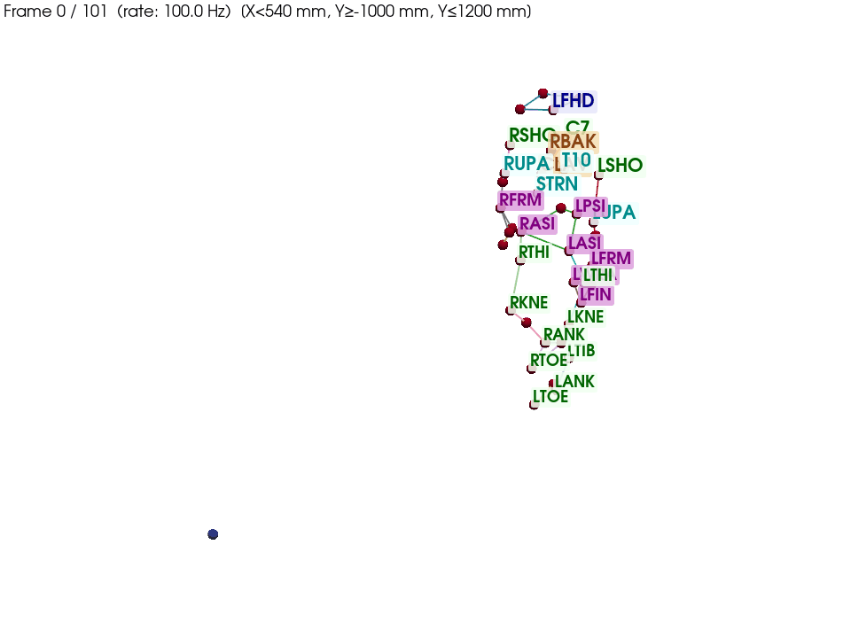

# marker-label

## Overview / Highlights

**Problem:** Full-body obstacle-crossing trials arrive as unlabeled dynamic C3D with dozens of anonymous marker columns—manual labeling per trial does not scale. Obstacle markers must be separated from body markers; propagation can still leave **label↔trajectory swaps** on pelvis, head, thorax, and arms; gaps and occlusions block downstream gait analysis.

**How we solve it** (rule-based pipeline, no learned model):

| Stage | Challenge | Approach |
|-------|-----------|----------|
| **Label** | Unlabeled `Point_*` columns | Subject **static template**; **stationary obstacle pair** detection; middle-frame match + **bidirectional propagation** with distance gates |
| **Trim** | Long trials, bad windows | Leg-segment **rigid geometry QC** around the best frame → `*_trimmed.csv` |
| **Relabel** | Swapped / teleported labels on rigid clusters | **Static-reference cluster shapes**; per-frame **Kabsch** pose + **Hungarian** slot assignment; forward/backward merge; optional **rigid fill** → `*_corrected.csv` |
| **Gap fill** | Short and long occlusions | Spline phases; **two-marker rigid** segments; foot/hand synthesis from **static** geometry |
| **QC** | Human review at scale | **3D segment viewer** with playback (`marker-label-view`) |

**Highlights:** End-to-end from C3D to analysis-ready CSVs; batch CLIs for trim, relabel, and gap fill; integrates with [gait-spatiotemporal](https://github.com/yesiam0225/gait-spatiotemporal) and [gait-mos-kinematics](https://github.com/yesiam0225/gait-mos-kinematics). Details: [Trial trim and marker relabel](#trial-trim-and-marker-relabel), [Gap filling](#gap-filling).

## Demo — 3D QC viewer

Playback of labeled full-body markers and segment sticks (same styling as `marker-label-view`):



*Pre-IRB feasibility demo; consented colleague volunteer — not study participants. Anatomical labels only; no trial filenames or participant identifiers.*

```bash
pip install -e ".[qc]"
marker-label-view path/to/trial_labeled.csv
```

Regenerate GIF: `PYTHONPATH=src python examples/generate_demo_assets.py` ([examples/README.md](examples/README.md)).

### Pipeline (this repo in context)

```text
marker-label (label → trim → relabel → gap fill)
    → gait-spatiotemporal (IC/TO, strides)
    → gait-mos-kinematics (kinematics, MoS)
```

| Repo | Portfolio visual |
|------|------------------|
| **marker-label** (here) | 3D QC viewer GIF (above) |
| [gait-spatiotemporal](https://github.com/yesiam0225/gait-spatiotemporal) | Foot-Z + detected IC/TO |
| [gait-mos-kinematics](https://github.com/yesiam0225/gait-mos-kinematics) | Ensemble kinematics plots (in progress) |

## Features

- **Subject-specific**: Uses each subject's labeled static trial to build a body template.
- **Obstacle markers**: Detected first. **Default:** `rod_pair` mode (median motion + rod geometry on simultaneous finite frames; min visibility **0.72**; motion cap **5.0** mm/frame unless disabled). Labels **OBSTACLE_L** / **OBSTACLE_R**. Use `--obstacle-mode legacy` for the older “two lowest mean-motion columns” rule.
- **Body markers**: Template match at a middle high-quality frame, then propagate labels forward and backward.
- **Trial trim + relabel**: After labeling, trim to a high-quality window and **relabel rigid clusters** (pelvis, head, thorax, arms) using static reference geometry — primary path to `*_corrected.csv`. See [Trial trim and marker relabel](#trial-trim-and-marker-relabel).
- **Gap filling**: Static-aware fill on corrected labeled CSVs (spline/rigid phases, foot and hand synthesis). See [Gap filling](#gap-filling).
- **Output**: Both original (NaNs preserved) and filled C3D and CSV (rows = frames, columns = frame, time, `{marker}_x`, `{marker}_y`, `{marker}_z`).

## Install

```bash
pip install -e .
```

Dependencies: `c3d`, `numpy`, `scipy`. For the 3D QC viewer: `pip install -e ".[qc]"` (adds `pyvista`).

## Usage

### CLI

```bash
# Example: label SUBJ01 using its static (SUBJ01 Cal 01.c3d) and unlabeled dynamic (SUBJ01 Trial 05.c3d)
marker-label "path/to/SUBJ01 Cal 01.c3d" "path/to/SUBJ01 Trial 05.c3d" -o out/SUBJ01_trial05
```

Options:
- `-o, --output`: Output path prefix (default: dynamic path + `_labeled`).
- `--no-filled`: Do not export filled C3D/CSV.
- `--obstacle-visibility FRAC`: Min visibility for obstacle candidates (default **0.72**, for `rod_pair`). Use e.g. **0.80** with `--obstacle-mode legacy` if needed.
- `--obstacle-mode {rod_pair,legacy}`: **Default `rod_pair`** (rod geometry + median motion). `legacy` = two lowest **mean**-motion columns among qualified candidates.
- `--obstacle-max-motion-mm MM`: Candidate motion cap (**median** in `rod_pair`, **mean** in `legacy`). **Omitted = default 5.0 mm/frame.** Use `0` to disable the cap.
- `--max-interp-frames N`: Max gap length for spline interpolation (default 10).
- `--static-facing AXIS`, `--dynamic-facing AXIS`: When static and dynamic were captured with the subject facing different lab axes (e.g. static facing **y**, dynamic facing **x**), use `--static-facing y --dynamic-facing x` so the pipeline rotates dynamic to align with static before matching. Values: `x`, `-x`, `y`, `-y`. Output coordinates remain in the original lab frame.
- `--static-unit {mm,m}`, `--dynamic-unit {mm,m}`: Unit of the C3D coordinates (default `mm`). Use `m` if the file is in meters; coordinates are scaled to mm internally so static and dynamic match.
- `--max-match-distance MM`: Reject initial assignment when point–template distance > MM mm (e.g. 300) to avoid bad matches.
- `--max-propagation-distance MM`: Do not propagate a label to the nearest point if it is > MM mm away (e.g. 150) to reduce swaps after dropout or when markers cross.
- `--reference-report JSON`: Use reference analysis (from `marker-label-analyze -o`) to set best-frame search window and optional distance thresholds. See [docs/REFERENCE_GUIDED_LABELING.md](docs/REFERENCE_GUIDED_LABELING.md).
- `--drop-extra-stationary-below-mm MM`: After obstacle detection, drop non-obstacle screened columns whose full-trial mean inter-frame speed is below `MM` mm/frame (and visibility meets the obstacle threshold). **Omitted = use the built-in default (standard processing).** Use `0` only in exceptional cases; document why.
- `--no-drop-extra-stationary`: Turn off that drop entirely (overrides default). **Standard runs leave it on;** use only for exceptional cases and document why.
- `--no-check-screened-count`: Allow screened column count other than 41 (e.g. extra hardware channels).

### Python

```python
from marker_label.pipeline import run_pipeline

# Standard processing: omit ``drop_extra_stationary_motion_max_mm`` (default threshold when two obstacles exist).
run_pipeline(
    "static_labeled.c3d",
    "dynamic_unlabeled.c3d",
    "out/trial_01",
    # obstacle_visibility_min defaults to 0.72 (rod_pair); pass 0.80 for legacy mode
    static_facing_axis="y",   # optional: subject facing y in static
    dynamic_facing_axis="x",  # optional: subject facing x in dynamic
    export_filled=True,
    max_interp_frames=10,
)
```

### Quality inspection

After labeling, check quality of the output CSV:

```bash
marker-label-inspect out/trial_01_labeled.csv
```

Options:
- `--velocity-threshold MM`: Flag velocity jumps above this (mm). Default: 100.
- `--visibility-warn FRAC`: Mark visibility below this as low. Default: 0.80.
- `--max-jumps N`: Max number of velocity jumps to list. Default: 20.

The report shows per-marker visibility, large frame-to-frame velocity jumps (possible swaps or bad assignment), and obstacle stationarity (should be near 0 mm).

From Python:

```python
from marker_label.inspect_quality import run_quality_report, print_quality_report

print_quality_report("out/trial_01_labeled.csv")
# or
report = run_quality_report("out/trial_01_labeled.csv")
# report["visibility"], report["velocity_jumps"], report["obstacle_std"], etc.
```

### Trial trim and marker relabel

Initial `marker-label` output can still have **label↔trajectory swaps** (especially pelvis, head, thorax, arms) after propagation. The **relabel** step recovers the correct correspondence per frame using **rigid-cluster geometry**, optionally guided by each subject’s **labeled static trial**.

Typical file flow:

```text
SUBJ01 Trial 05_labeled.csv
  → marker-label-trial-trim …     → SUBJ01 Trial 05_trimmed.csv (+ *.csv.bestframe)
  → marker-label-relabel …        → SUBJ01 Trial 05_corrected.csv
  → marker-label-gap-fill …       → gap-filled CSV for gait analysis
```

**Trim** (`marker-label-trial-trim`): crop the labeled CSV to a contiguous window around the pipeline best frame using leg-segment geometry QC. Writes `*_trimmed.csv` and a `*.csv.bestframe` sidecar (1-based frame index).

**Relabel** (`marker-label-relabel`, `src/marker_label/relabel_markers.py`): for each rigid cluster (pelvis, head, thorax, left/right arm), solve a per-frame rigid pose and reassign trajectories to marker **slots** — **label-agnostic** (does not trust column IDs). Candidates are in-band labeled points plus unlabeled donor columns (`*` or numeric names). Forward and backward passes are merged; optional spike cleaning on non-rigid markers and cross-cluster mislabel reports.

Static reference (recommended): cluster **shape templates** from the subject static (`--static` or `--static-auto` under `data/{subject_id}/`). Without static, templates are bootstrapped from clean frames in the trial.

**Single trial:**

```bash
marker-label-trial-trim "out/SUBJ01 Trial 05_labeled.csv" \
  -o "corrected/SUBJ01 Trial 05_trimmed.csv"

marker-label-relabel "corrected/SUBJ01 Trial 05_trimmed.csv" \
  --static "data/SUBJ01/SUBJ01 Cal 01.c3d" \
  --rigidfill
# default output: corrected/SUBJ01 Trial 05_corrected.csv
```

Useful flags: `--inlier-tol` (default 35 mm), `--dtol` (default 20 mm template distance tolerance), `--rigidfill` (synthesize missing cluster markers from rigid pose when ≥3 mates are present).

**Outputs** (beside `*_corrected.csv`):

| File | Purpose |
|------|---------|
| `*_labelmap.csv` | Per-frame slot assignment log (`cluster`, `slot`, `source`, `rms_mm`) |
| `*_crosslabel.csv` | Markers sitting at another segment’s slot (when detected) |

**Batch cohort** (manifest `csv_path` per trial; static paths from map or auto-discovery):

```bash
python scripts/batch_relabel_obs_trials.py "corrected/obs_trials.csv" \
  --static-map corrected/subject_static_map.csv \
  --in-place --backup --rigidfill
```

Generate a static-map template: `--write-static-map corrected/subject_static_map.csv`.

Trim-only batch: `scripts/batch_relabel_trimmed.py` (runs relabel on existing `*_trimmed.csv`).

**Alternate correction:** `marker-label-correct-trimmed` (`trimmed_csv_marker_correction.py`) uses **reference geometry from the original full dynamic trial** (best frame) with envelope filtering, chain swaps, and tier-based rules — complementary to relabel, not a substitute. Most cohort workflows use **relabel** as the primary path to `*_corrected.csv`.

### Gap filling

Fill gaps in **already labeled, marker-corrected** flat CSVs (`*_corrected.csv`). This is separate from the main `marker-label` labeling pipeline (which can export filled C3D/CSV at label time with a simpler interpolator).

**Single trial:**

```bash
marker-label-gap-fill "corrected/SUBJ01 Trial 10_corrected.csv" \
  -o "corrected/added/extra/SUBJ01 Trial 10_filled.csv" \
  --static-csv "data/SUBJ01/SUBJ01 Cal 01.c3d" \
  --segments-preset full-body
```

**Batch** (manifest CSV with `csv_path`, `subject_id`, …; static paths from `--static-map` or auto-discovery):

```bash
marker-label-batch-gap-fill corrected/obs_trials_gap_filled.csv \
  --output-dir corrected/gap_filled_full_body \
  --static-map corrected/subject_static_map.csv \
  --segments-preset full-body \
  --skip-existing
```

Extra cohort example: input paths in `corrected/added/extra_obs_trials.csv` → outputs under `corrected/added/extra/*_filled.csv`.

#### What the filler does

Phases (see `src/marker_label/gap_filling/orchestrator.py`):

1. Short gaps — spline / linear interpolation  
2. **Two-marker rigid fill** — when two of three segment markers are visible (`two_marker_static.py`)  
3. **Missing marker synthesis** — e.g. LHEE/RHEE from foot geometry; LWRB/LFIN from forearm frame or contralateral hand  
4. Long gaps — rigid propagation from static reference where configured  

Important frame rules (recent fixes):

| Marker type | Two-marker basis |
|-------------|------------------|
| Foot (HEE, TOE, ANK, …) | Foot basis (ankle–toe, shin axis from static) |
| Shank **TIB**, upper arm **UPA**, **ELB**, **SHO**, thigh **THI**, knee **KNE** | **Body segment** local frame (not foot basis) |

Hand markers without trajectories may be synthesized from forearm markers (LFRM+LWRA) or mirrored from the contralateral side when static reference is unavailable.

Common CLI flags: `--static-csv`, `--segments-preset {full-body,lower-body,legs-feet}`, `--no-two-marker-rigid`, `--enable-shoulder-from-thorax`, `--no-continuity-check`. Run `marker-label-gap-fill --help` for the full list.

#### Outputs (per trial)

For output path `…/Trial_filled.csv` the pipeline also writes:

| File | Purpose |
|------|---------|
| `Trial_filled.csv` | Gap-filled trajectories (downstream input) |
| `Trial_filled_fills.csv` | Per-frame fill log (method, source markers, confidence) |
| `Trial_filled_quality.json` | Summary metrics, reverts, static path used |
| `Trial_filled_summary.png` | QC plot |

Inspect fills with `marker-label-view Trial_filled.csv` or read `_fills.csv` for a specific marker/frame.

#### Re-run downstream after code changes

Gap-fill **code changes do not update existing `*_filled.csv` files** until you re-run `marker-label-gap-fill` or `marker-label-batch-gap-fill`. After re-filling, re-run **gait-spatiotemporal** and **gait_analysis** / **gait-mos-kinematics** on the new CSVs so stride events, kinematics, MoS, and peaks reflect the fix.

Tests: `pytest tests/test_gap_filling_phases.py -v`

### 3D QC viewer

View labeled C3D or CSV in 3D with **body segments** (sticks between markers) and playback. Segments are defined in `marker_label.segments.SEGMENTS` (Vicon-style: head, thorax, pelvis, arms, legs). Requires `[qc]`: `pip install -e ".[qc]"`. **Demo GIF:** [above](#demo--3d-qc-viewer).

```bash
marker-label-view path/to/trial_01_labeled.c3d
# or
marker-label-view path/to/trial_01_labeled.csv
```

Options: `--point-size` (default 12), `--font-size` (default 21, marker label text), `--speed` playback multiplier (default 1), `--background` (`white` or `black`), `--segment-color` (default `darkblue`), `--scale FACTOR` (e.g. 1000 if the file is in meters so markers display at mm scale), `--y-clip-min` / `--y-clip-max` (hide markers outside a lab-Y band in mm, after `--scale`; defaults -1000 and 1200). Zoom in the window with **+** / **-** keys or the on-screen Zoom buttons. There is no CLI for window pixel size; resize the PyVista window manually.

To add or change segments, edit `src/marker_label/segments.py`: each segment is an ordered list of marker names; consecutive pairs are drawn as lines (see docstring).

From Python:

```python
from marker_label.qc_viewer import run_viewer, load_data

run_viewer("trial_01_labeled.c3d", point_size=12, playback_speed=1, background="white")
```

### Compare static vs dynamic (same scene)

To see why labeling might fail, view the **static template** (green, labeled) and **dynamic trial** (red, one frame) in one 3D window. Use the slider to scrub through dynamic frames.

```bash
marker-label-compare path/to/static_labeled.c3d path/to/dynamic.c3d
# optional: align orientations (same as pipeline)
marker-label-compare path/to/static.c3d path/to/dynamic.c3d --static-facing y --dynamic-facing x
```

Options: `--frame N`, `--point-size`, `--background`, `--static-facing`, `--dynamic-facing`.

### Reference-subject analysis (`marker-label-analyze`)

Analyze a **manually labeled** static + dynamic pair from a reference subject to see how the static template relates to each dynamic frame (per-frame rigid transform, RMS, and which frame is “closest” to the template). Useful to tune pipeline behavior or inspect typical rotation/translation.

**Input files:** You must provide the **paths** to two C3D files from one **reference subject**, both **manually labeled** with the same marker names (e.g. in Vicon Nexus). Example: reference subject **REF01** — manually labeled static `REF01 Cal 01.c3d`, manually labeled dynamic `REF01 Trial 10.c3d`. (For the **subject you want to label**, e.g. SUBJ01, you use that subject’s labeled static and unlabeled dynamic with the main `marker-label` pipeline; the analyze tool is for a separate, reference subject.)

```bash
# Example: analyze reference subject REF01 (manually labeled static + dynamic)
marker-label-analyze "path/to/REF01 Cal 01.c3d" "path/to/REF01 Trial 10.c3d"
marker-label-analyze "path/to/REF01 Cal 01.c3d" "path/to/REF01 Trial 10.c3d" --sample 10 -o report.json
```

Options: `--sample N` (analyze every Nth frame; default 1), `--pelvis-frame` (build template in pelvis frame), `--static-unit {mm,m}`, `--dynamic-unit {mm,m}` (default mm; use m if file is in meters), `-o report.json` (write full result as JSON).

### Export C3D to flat CSV (no labeling)

Convert a raw or labeled `.c3d` to the same flat layout the pipeline uses (`frame`, `time`, `{marker}_x/y/z`). Marker names come from C3D point labels unless `--numeric-labels` is set.

```bash
PYTHONPATH=src python scripts/c3d_to_csv_column_indices.py \
  "data/SUBJ01/SUBJ01 Trial 05.c3d" \
  -o "data/SUBJ01/SUBJ01 Trial 05.csv"
```

Options: `-o` output path (default: input with `.csv`), `--scale 1000` (m → mm), `--numeric-labels` (force index-only column names), `--zero-based` (numeric fallback names 0, 1, …). The script prints a 0-based C3D index → label map to stderr.

## Pipeline summary

1. Load static (labeled) and dynamic (unlabeled) C3D.
2. Initial screening on the dynamic trial (Y range, optional frame trim, visibility) as configured.
3. Detect obstacle markers (default **`rod_pair`**: median motion, rod geometry, min visibility **0.72**; or **`legacy`**: two lowest mean-motion columns among qualified); remove from body labeling set.
4. **Extra stationary drop (standard):** After obstacles are known, drop other screened columns that are highly stationary and visible (full-trial mean inter-frame speed below a default mm/frame threshold). Runs when two obstacles are detected. **Default CLI/API behavior keeps this enabled** (`None` → default threshold). Disabling (`--no-drop-extra-stationary` or `--drop-extra-stationary-below-mm 0`) is for **exceptional** cases only (e.g. extra capture channels, debugging); note the reason in your workflow or PR when you disable it.
5. Build body template from static (mean position per label).
6. Select best frame in dynamic (middle portion, high quality, or a fixed frame if set).
7. Match remaining markers to template; propagate labels temporally (unless column-fixed mode).
8. Build full output: body labels (static order, NaN where missing) + OBSTACLE_L, OBSTACLE_R.
9. Export original and filled C3D + CSV.

**Post-labeling (recommended for obstacle-crossing cohorts):**

10. **Trial trim** — `marker-label-trial-trim` → `*_trimmed.csv`.
11. **Marker relabel** — `marker-label-relabel` with subject static → `*_corrected.csv` (see [Trial trim and marker relabel](#trial-trim-and-marker-relabel)).
12. **Gap fill** — `marker-label-gap-fill` / batch on `*_corrected.csv` (see [Gap filling](#gap-filling)).

For a detailed explanation of the logic and what to check when labeling fails, see [docs/MARKER_LABELING_LOGIC.md](docs/MARKER_LABELING_LOGIC.md).

## Pelvis markers

Vicon full-body pelvis markers: LASI, RASI, LPSI, RPSI (and SACR if present). Used when building template in pelvis frame; currently template matching defaults to lab frame.

## Downstream gait analysis

Labeled or gap-filled marker CSVs (`frame`, `{marker}_x/y/z`, mm, 100 Hz) feed external spatiotemporal detection, then in-repo or sibling kinematics/MoS batch jobs. Frame indices in `per_stride_data.csv` are **0-based row indices** into the trial CSV passed on the command line.

### Related repositories

| Repository | Role |
|------------|------|
| [gait-spatiotemporal](https://github.com/yesiam0225/gait-spatiotemporal) | IC/TO detection, strides, `per_stride_data.csv`, `per_step_data.csv` |
| [gait-mos-kinematics](https://github.com/yesiam0225/gait-mos-kinematics) | Kinematics ensemble + **joint peak CSVs** (`batch-kinematics-peaks`, `batch-kinematics-ensemble` with spike filtering) |

Each sibling repo README documents its stage of this pipeline (CLI, inputs/outputs, and cross-links back here).

In-repo **`gait_analysis/`** runs kinematics ensemble and MoS (discrete + time-series + QC plots). See [gait_analysis/README.md](gait_analysis/README.md). It does **not** export peak CSVs; use **gait-mos-kinematics** for `kinematics_all_strides.csv` and `peaks_per_stride.csv`.

### Batch workflow (full cohort)

Typical order:

1. **Label** — `marker-label` → `*_labeled.csv`
2. **Trim + relabel** — `marker-label-trial-trim` → `*_trimmed.csv`; `marker-label-relabel` → `*_corrected.csv` (or batch via `scripts/batch_relabel_obs_trials.py`)
3. **Gap fill** — `marker-label-batch-gap-fill` → `corrected/gap_filled_full_body/` (manifest `obs_trials_gap_filled.csv`)
4. **Spatiotemporal** — `spatiotemporal-gait --trial-manifest … --output-dir gait_spatiotemporal_out/`
5. **Kinematics + MoS** — `gait_analysis/run_all.py` with matching `--obs-csv`, `--ps-csv`, `--trial-dir`
6. **Peaks (optional)** — `batch-kinematics-peaks` and `batch-kinematics-ensemble` from gait-mos-kinematics

Example (main gap-filled cohort):

```bash
# 1. Spatiotemporal (sibling repo; install with pip install -e .)
spatiotemporal-gait \
  --trial-manifest corrected/obs_trials_gap_filled.csv \
  --output-dir gait_spatiotemporal_out \
  --subject-id SUBJ01 --group adult --board RB --time pre

# 2. Kinematics + MoS (from repo root)
python gait_analysis/run_all.py \
  --obs-csv corrected/obs_trials_gap_filled.csv \
  --ps-csv gait_spatiotemporal_out/per_stride_data.csv \
  --trial-dir corrected/gap_filled_full_body
```

Default MoS/kinematics output: `gait_analysis/output/` (or set `GAIT_OUTPUT_DIR`). A full-cohort run with explicit paths is often written under `output/gait_mos_kinematics/`.

### Batch workflow (extra cohort)

Additional gap-filled trials live under `corrected/added/extra/` with manifest `corrected/added/extra_obs_trials.csv` (columns: `csv_path`, `subject_id`, `trial`, `board`, `time`, `group`, `leg_length_mm`, `height_mm`).

```bash
# 1. Spatiotemporal
spatiotemporal-gait \
  --trial-manifest corrected/added/extra_obs_trials.csv \
  --output-dir gait_spatiotemporal_out/extra \
  --subject-id SUBJ01 --group adult --board RB --time pre

# 2. Kinematics + MoS (custom output dir via per-script --output-dir)
cd gait_analysis/src
python batch_kinematics_ensemble.py \
  --obs-csv ../../corrected/added/extra_obs_trials.csv \
  --ps-csv ../../gait_spatiotemporal_out/extra/per_stride_data.csv \
  --trial-dir ../.. \
  --output-dir ../../output/gait_mos_kinematics_extra/ensemble_curves
# … batch_mos.py, batch_mos_timeseries.py, visualize_mos.py with the same obs/ps/trial-dir

# 3. Joint peaks (gait-mos-kinematics sibling repo)
batch-kinematics-peaks \
  --obs-csv corrected/added/extra_obs_trials.csv \
  --ps-csv gait_spatiotemporal_out/extra/per_stride_data.csv \
  --trial-dir . \
  --output-dir output/gait_mos_kinematics_extra/peaks/

batch-kinematics-ensemble \
  --obs-csv corrected/added/extra_obs_trials.csv \
  --ps-csv gait_spatiotemporal_out/extra/per_stride_data.csv \
  --trial-dir . \
  --output-dir output/gait_mos_kinematics_extra/ensemble_curves
# also writes peaks/peaks_per_stride.csv alongside ensemble_curves/
```

### Output layout (reference)

| Stage | Typical path | Key files |
|-------|----------------|-----------|
| Trim + relabel | `corrected/` | `*_trimmed.csv`, `*_corrected.csv`, `*_labelmap.csv` |
| Gap fill (main) | `corrected/gap_filled_full_body/` | `*_filled.csv`, manifest `obs_trials_gap_filled.csv` |
| Spatiotemporal (main) | `gait_spatiotemporal_out/` | `per_stride_data.csv`, `per_step_data.csv` |
| Spatiotemporal (extra) | `gait_spatiotemporal_out/extra/` | same names |
| Kinematics + MoS (main) | `output/gait_mos_kinematics/` | `ensemble_curves/`, `mos/`, `mos_timeseries/`, `mos_plots/`, `peaks/` |
| Kinematics + MoS (extra) | `output/gait_mos_kinematics_extra/` | same layout + `event_plots/` for IC/TO QC |
| Peaks (gait-mos-kinematics) | `…/peaks/` | `kinematics_all_strides.csv`, `peaks_per_stride.csv`, `peaks_subject_condition.csv` |

### Step parameters and phases

- **`per_step_data.csv`**: one row per IC; `step_length_mm` / `step_width_mm` are stored on the **landing IC** and require a previous opposite-foot IC (first IC in a trial is NaN).
- **Stride phase** (`approach`, `crossing_lead`, `crossing_trail`, `recovery`) is assigned per **same-foot stride**, not per contralateral HS→HS step. Step-level phase labels for analysis may need a separate export (see gait-spatiotemporal / future `step_phase` work).
- **MoS clearance** (`ap_clearance`, `ml_clearance`) = `step_length_mm − mos_ap_HS` (Beerse et al.); NaN when `step_length_mm` is NaN.

### QC scripts

- IC/TO on foot-Z traces: `scripts/plot_spatiotemporal_events_batch.py` (uses gait-spatiotemporal event detection).
- Extra cohort example plots: `output/gait_mos_kinematics_extra/event_plots/<subject>_<board>_<time>/`.

## License

MIT — see [LICENSE](LICENSE).
